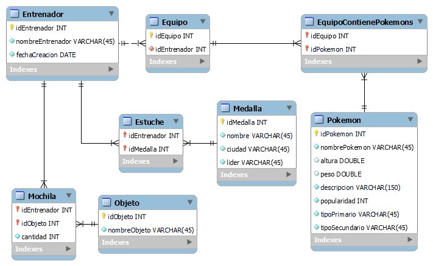

# PROYECTO-FINAL-MULTIMODULAR

## Objetivo final del proyecto
Realizar un programa que permita la gestión de entrenadores pokémon y de sus equipos.

## Especificación de requisitos y análisis de los mismos
### 1. Registro de Entrenadores:
- Los usuarios podrán registrar nuevos entrenadores pokémon en el sistema.
- Se recopilará su nombre y su fecha de creación.
### 2. Visualización de Entrenadores:
- Los usuarios podrán ver un listado de los entrenadores registrados en el sistema. Ordenados por llegada
- La lista mostrará el nombre del entrenador, las medallas del entrenador, sus objetos y su equipo.
### 3. Edición de Entrenadores:
- Los usuarios podrán editar la información de los entrenadores existentes en el sistema.
- Se debe actualizar el listado de entrenadores.
### 4. Eliminación de Entrenadores:
- Los usuarios podrán eliminar los entrenadores si lo desean.
- Se debe actualizar el listado de entrenadores.
### 5. Gestión de Equipos:
- Los usuarios podrán asignar equipos pokémon a los entrenadore registrados.
- Se permite la adición y la eliminación de pokémon al equipo, teniendo un máximo de 6 pokémons.
### 6. Búsqueda de Entrenadores:
- Los usuarios podrán buscar a los entrenadores por nombre, por el número de pokémons en su equipo, por el tipo de sus pokemons, por la popularidad de su equipo, por el peso total de su equipo y por la altura total de su equipo.
### 7. Datos de la Pokédex:
- Los usuarios podrán buscar información detallada de cualquier pokémon de primera generación.
### 8. Retar gimnasios:
- Los usuarios podrán retar un gimnasio que hará 5 preguntas aleatorias sobre pokémon, si las acierta gana un medalla, siendo el máximo 8.
- Se debe actualizar el entrenador.
### 9. Compra de Objetos:
- Los usuarios podrán comprarle objetos a los entrenadores, se guardará en su mochila
- Se debe actualizar el entrenador con su mochila.

## Modelo conceptual

## Modelo lógico

- Entrenador(**idEntrenadorPK**, nombreEntrenador, fechaCreacion)
- Equipo(**idEquipoPK**, _idEntrenadorFK_)
- EquipoContienePokemons(**_idEquipo_PKFK**, **_idPokemon_PKFK**)
- Pokemon(**idPokemonPK**, nombrePokemon, altura, peso, descripcion, popularidad, tipoPrimario, tipoSecundario)
- Estuche(**_idEntrenador_PKFK**, **_idMedalla_PKFK**)
- Medalla(**idMedallaPK**, nombre, ciudad, lider)
- Mochila(**_idEntrenador_PKFK**, **_idObjeto_PKFK**, cantidad)
- Objeto(**idObjetoPK**, nombreObjeto)

## UML

